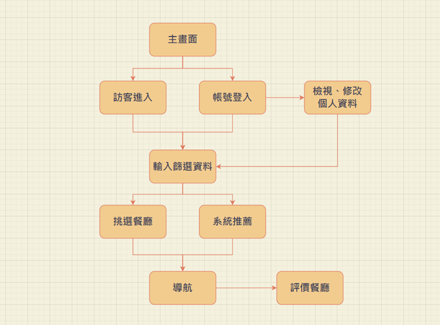
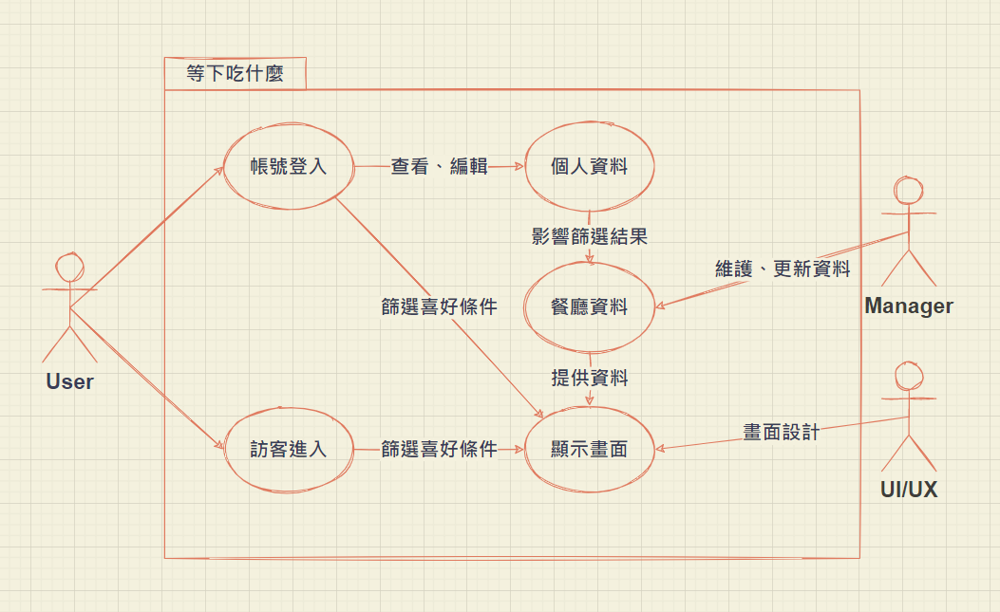
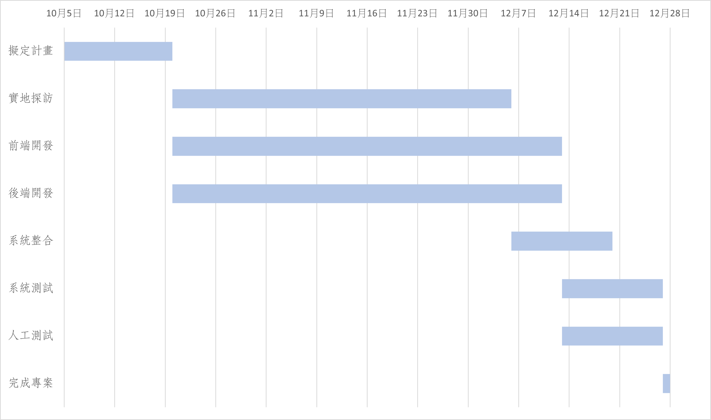
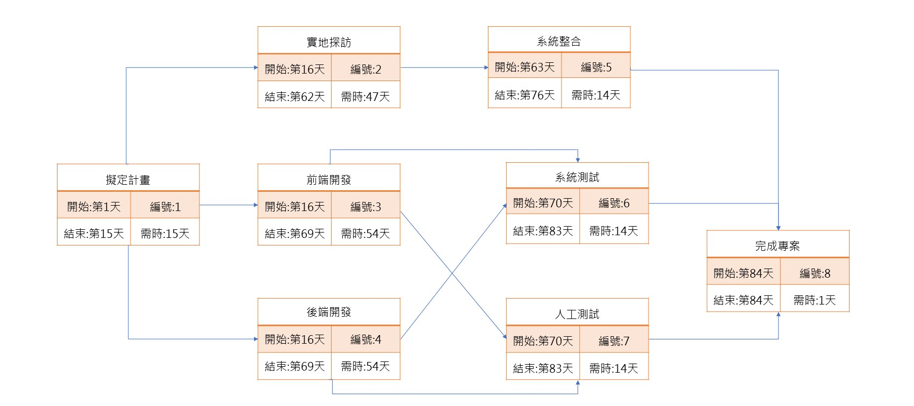

# 第五組

## 分工：
| 職位 | 學號 | 姓名 | 工作 |
|:----:|:----:|:----:|:----:|
|組長 | C108118235 | 許琇喬 | 實地 |
|組員 | C108118219 | 鄧蘋珊 | 前端 |
|組員 | C108118218 | 呂紹勳 | 後端 |
|組員 | C108118216 | 張珮君 | 全端 |
|組員 | C108118250 | 林悅如 | 文書 |

***

## 題目：等下吃什麼
### 內容：
>每到用餐時間是否都因煩惱著要吃什麼而感到痛苦呢...
>
>別再煩惱了!!!
>只要有了這個app 就能擺脫這個無謂的煩惱
>
>>透過事先設定篩選條件，
再藉由定位即可隨機推薦附近的美食，
經由此app能夠了解店內菜單與用餐環境(有無提供冷氣或免費涼飲等其他服務)及顧客評分，
透過篩選排序後可以清楚得知擁有您特殊條件的餐廳有哪些，
即可進行挑選
(若是患有選擇困難症的人類，還能使出抽籤這項功能哦，讓機器幫你做選擇:))
確認完畢後還可連結至google map進行路線導引，
用餐完畢後可以進行用餐評分，為其他用戶帶來更好的推薦唷:)

***
### 功能性需求：
* 分析使用者對餐廳的要求
* 幫助使用者篩選出符合要求的餐廳
* 隨機推薦餐廳
### 非功能性需求：
* 反應時間:設定完篩選條件後，後台分析反應時間
* 使用性:人性化設計，易上手
* 維護性:易維護
***
## 需求分析：
1. 附近優質美食快速指南
2. 根據使用者需求進行篩選
3. 無法自行決定之用戶可選用自動推薦
4. 使用導航服務時會自動切換至google map，用戶無需自行開啟
5. 查看餐廳評價

## 功能分解圖：

## 使用案例圖：

## 使用案例說明：

| 使用案例名稱 | 設定個人資料 |
|:------------|:-----|
|行動者        | 使用者 |
|說明          |設定常用選擇|
|完成動作      | ... |
|替代方法      | ... |
|先決條件      | ... |
|後置條件      | ... |
|假設          | ... |

| 使用案例名稱 | 依據喜好條件篩選 |
|:------------|:-----|
|行動者        | 使用者 |
|說明          | ... |
|完成動作      | ... |
|替代方法      | ... |
|先決條件      | ... |
|後置條件      | ... |
|假設          | ... |

| 使用案例名稱 | 資料維護與更新 |
|:------------|:-----|
|行動者        | 開發者 |
|說明          | ... |
|完成動作      | ... |
|替代方法      | ... |
|先決條件      | ... |
|後置條件      | ... |
|假設          | ... |

## 甘特圖：

## PERT/CPM圖：

