# 第五組 🍕 🍝 🍲 🍛 🍜

## 分工：
| 職位 | 學號 | 姓名 | 工作 |
|:----:|:----:|:----:|:----:|
|組長 | C108118235 | 許琇喬 | 實地 |
|組員 | C108118219 | 鄧蘋珊 | 前端 |
|組員 | C108118218 | 呂紹勳 | 後端 |
|組員 | C108118216 | 張珮君 | 全端 |
|組員 | C108118250 | 林悅如 | 文書 |

***
## 題目：[等下吃什麼](https://docs.google.com/presentation/d/1oi8Gjl6MIHE4Hg6rnl9_qNno82cL2_CB/edit?usp=sharing&ouid=109712475882388543240&rtpof=true&sd=true)
### 內容：
>每到用餐時間是否都因煩惱著要吃什麼而感到痛苦呢...
>
>別再煩惱了!!!
>只要有了這個app 就能擺脫這個無謂的煩惱
>
>>透過事先設定篩選條件，
再藉由定位即可隨機推薦附近的美食，
經由此app能夠了解店內菜單與用餐環境(有無提供冷氣或免費涼飲等其他服務)及顧客評分，
透過篩選排序後可以清楚得知擁有您特殊條件的餐廳有哪些，
即可進行挑選
(若是患有選擇困難症的人類，還能使出抽籤這項功能哦，讓機器幫你做選擇:))
確認完畢後還可連結至google map進行路線導引，
用餐完畢後可以進行用餐評分，為其他用戶帶來更好的推薦唷:)
>>
>>若餐廳有更新資料也可藉由使用者反饋使app資料更符合現況

***
### 功能性需求：
* 分析使用者對餐廳的要求
* 幫助使用者篩選出符合要求的餐廳
* 隨機推薦餐廳
### 非功能性需求：
* 反應時間:設定完篩選條件後，後台分析反應時間(約3秒內)
* 使用性:人性化設計，易上手
* 維護性:易維護，使用git管理部分程式碼

***
## 需求分析：
1. 附近優質美食快速指南
2. 根據使用者需求進行篩選
3. 無法自行決定之用戶可選用自動推薦
4. 使用導航服務時會自動切換至google map，用戶無需自行開啟
5. 查看餐廳評價

## 功能分解圖：

## 使用案例圖：

## 使用案例說明：

| 使用案例名稱 | 設定個人資料 |
|:------------|:-----|
|行動者        | 使用者 |
|說明          |建立或更新個人資料|
|完成動作      | 1.編輯個人資料 2.可添加喜愛的餐廳 |
|替代方法      | 可直接設定篩選條件 |
|先決條件      | 無 |
|後置條件      | 查看&紀錄喜愛的餐廳 |
|假設          | 無 |

| 使用案例名稱 | 依據喜好條件篩選 |
|:------------|:-----|
|行動者        | 使用者 |
|說明          | 設定篩選條件 |
|完成動作      | 即可顯示符合您喜好的餐廳 |
|替代方法      | 可透過添加喜愛餐廳的標籤進行探索 |
|先決條件      | 無 |
|後置條件      | 對結果不滿意可重設條件 |
|假設          | 無 |

| 使用案例名稱 | 資料維護與更新 |
|:------------|:-----|
|行動者        | 店家、管理者 |
|說明          | 更新與維護資料庫 |
|完成動作      | 將資料匯入資料庫 |
|替代方法      | 無 |
|先決條件      | 資料有更新 |
|後置條件      | 使用戶取得更新的餐廳資訊 |
|假設          | 無 |

## DFD：
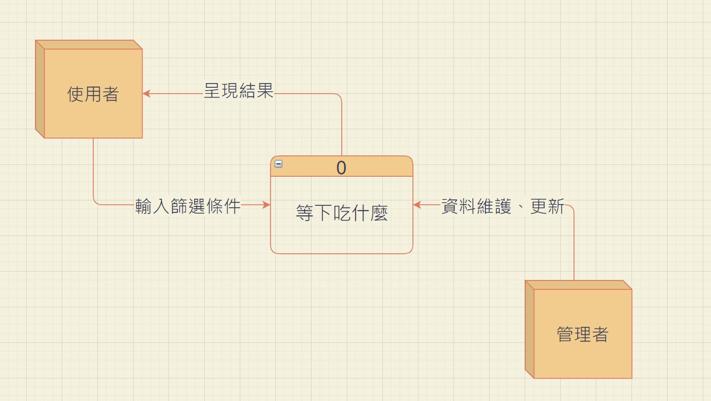

## DFD_0：
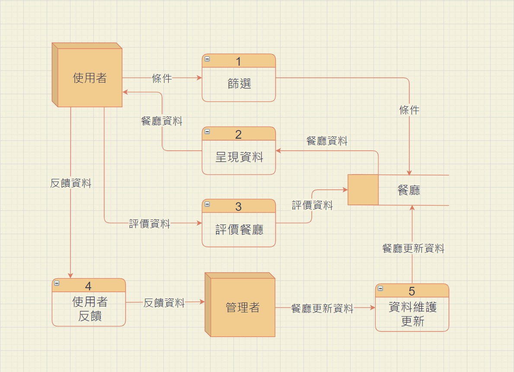

## UML：
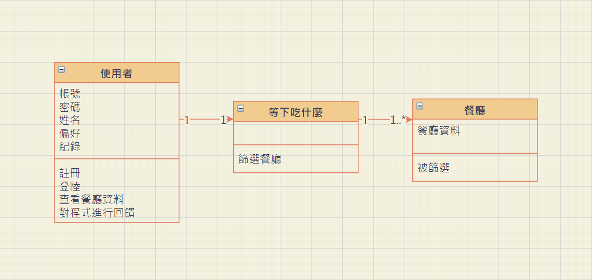

## 循序&活動圖：
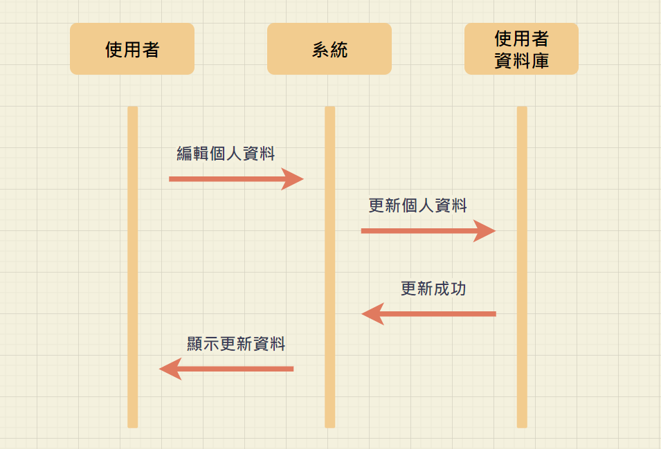
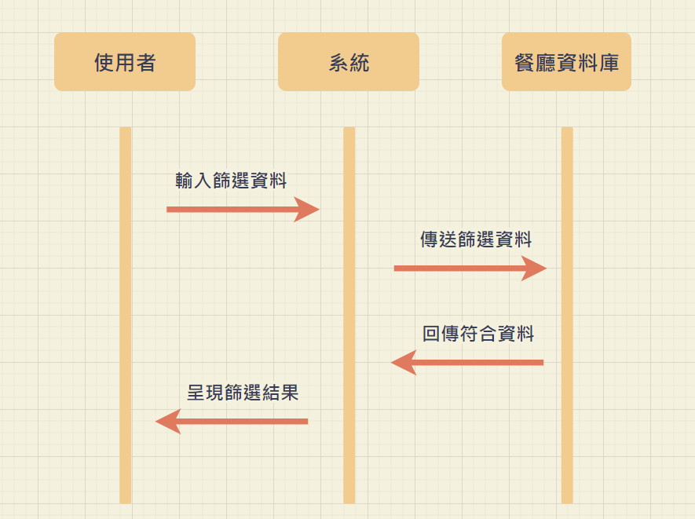
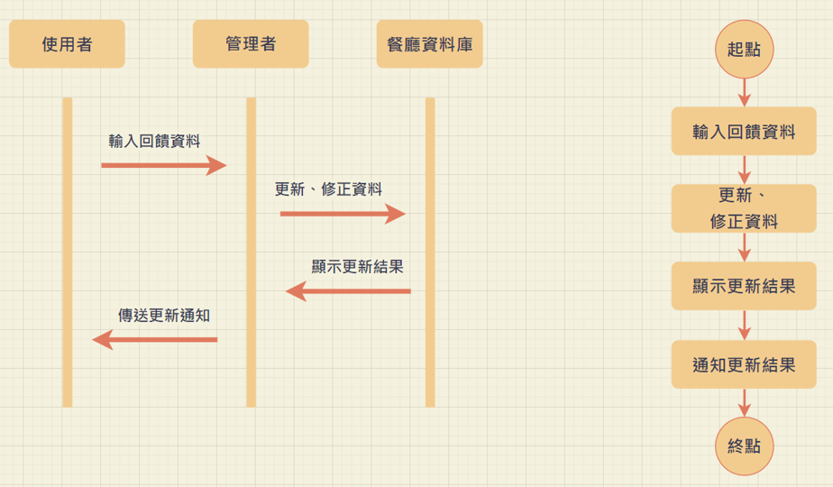

***

## 分鏡腳本
## 登入畫面

| 欄位名稱 | 資料型態 | 驗證規則 |
|:----:|:----:|:----:|
|帳號 | varchar | 是否為16字元內的英數組合 |
|密碼 | varchar | 英數符號組合，但不得有空格 |

## 註冊畫面

| 欄位名稱 | 資料型態 | 驗證規則 |
|:-------:|:-------:|:-------:|
|使用者名稱 | varchar | 是否為16字元內的英數組合|
|手機 | varchar | 是否由10個數字字串組成，且前兩碼為"09" |
|電子信箱 | varchar | 檢查電子信箱是否符合規定，字串須包含"@"、"."|
|密碼 | varchar | 英數符號組合，但不得有空格 |
|確認密碼 | varchar | 是否與密碼輸入相同 |

## 忘記密碼

| 欄位名稱 | 資料型態 | 驗證規則 |
|:-------:|:-------:|:-------:|
|電子信箱/手機 | varchar |檢查電子信箱是否符合規定，字串須包含"@"、"."與是否由10個數字字串組成，且前兩碼為"09"|

## 店家資訊
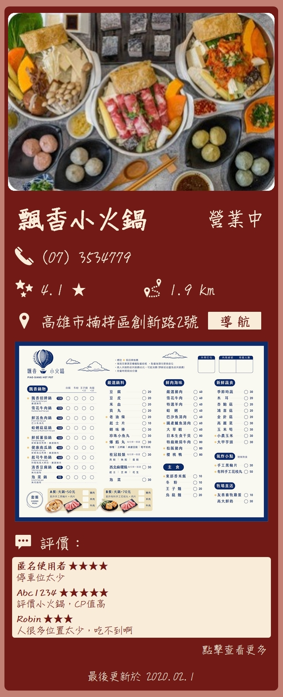

## 店家評論
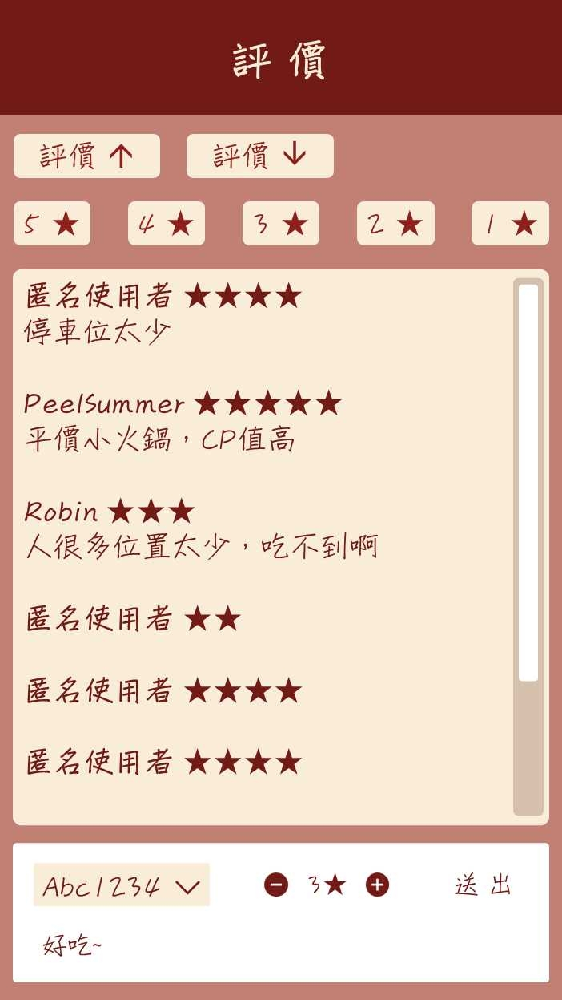
| 欄位名稱 | 資料型態 | 驗證規則 |
|:----:|:----:|:----:|
|評論 | varchar | 內容長度不得超過1000字元 |
|評價 | int | 限制1~5分 |

## 篩選條件
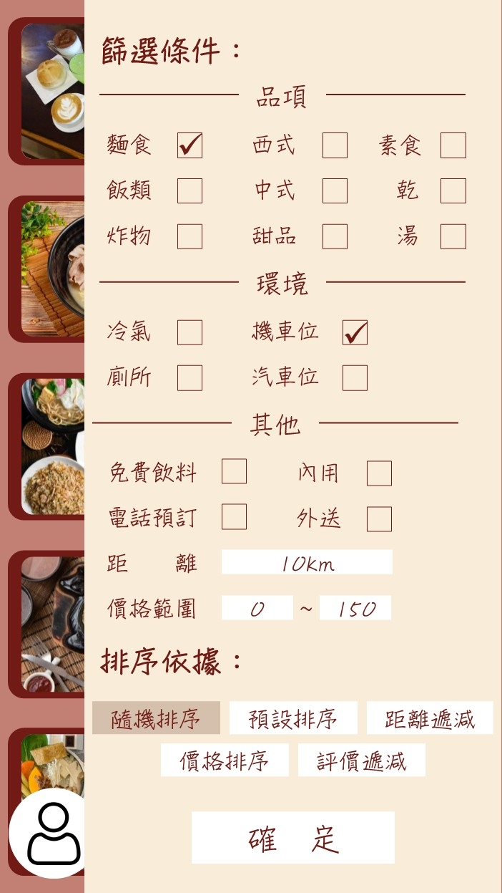
| 欄位名稱 | 資料型態 | 驗證規則 |
|:----:|:----:|:----:|
|距離 | int | >0 |
|價格範圍 | int | >0且右邊欄位要比左邊大 |

## 彈出視窗

| 欄位名稱 | 資料型態 | 驗證規則 |
|:----:|:----:|:----:|
|帳號 | varchar | 檢查電子信箱是否符合規定，字串須包含"@"、"." |
|密碼 | varchar | 英數符號組合，但不得有空格 |

## 個人檔案

| 欄位名稱 | 資料型態 | 驗證規則 |
|:-------:|:-------:|:-------:|
|使用者名稱 | varchar | 16個字元內的英數組合|
|手機 | varchar | 是否由10個數字字串組成，且前兩碼為"09" |
|電子信箱 | varchar | 檢查電子信箱是否符合規定，字串須包含"@"、"."|

## 新增偏好
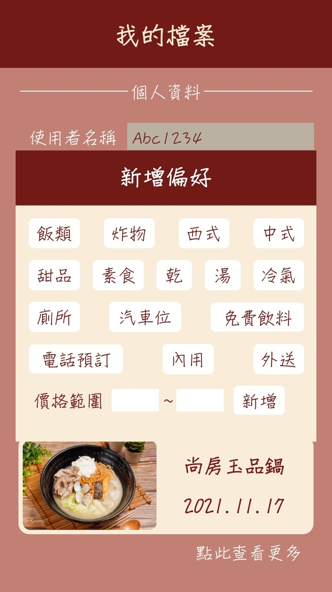
| 欄位名稱 | 資料型態 | 驗證規則 |
|:----:|:----:|:----:|
|價格範圍 | int | >0且右邊欄位要比左邊大 |

## 歷史紀錄

***

## 實體關係圖：
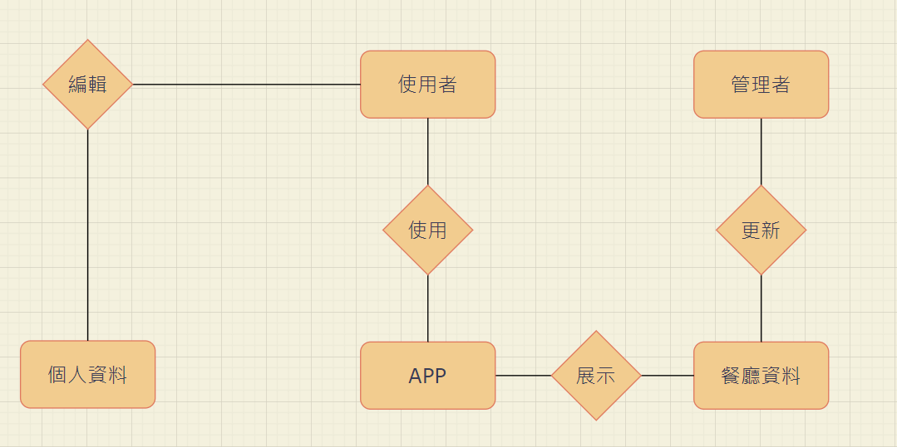
## 甘特圖：

## PERT/CPM圖：

